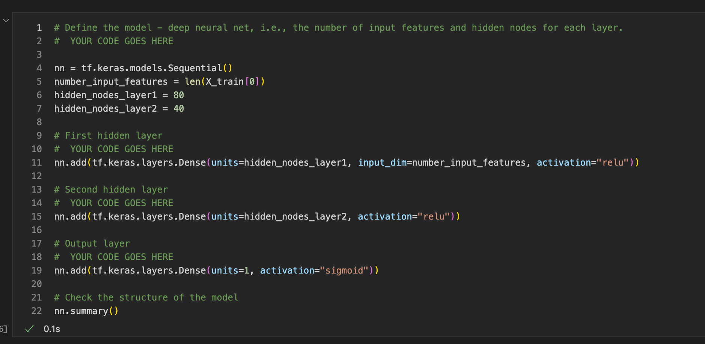
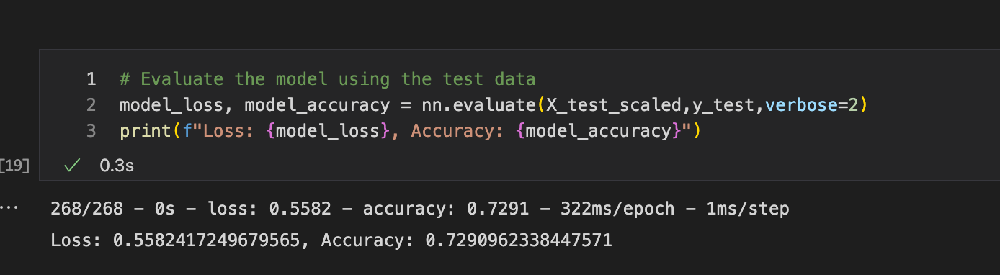
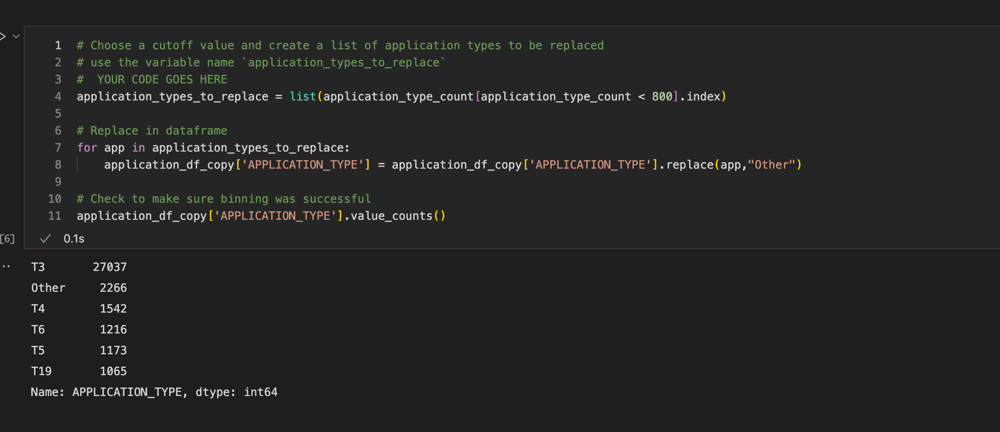
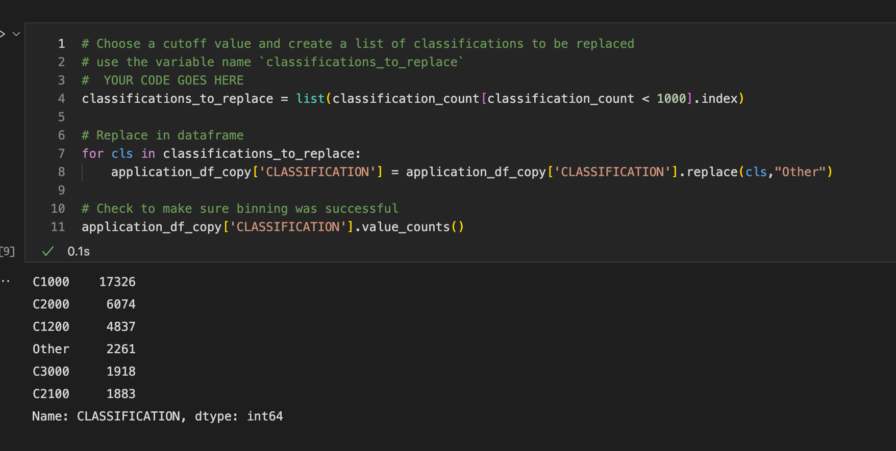
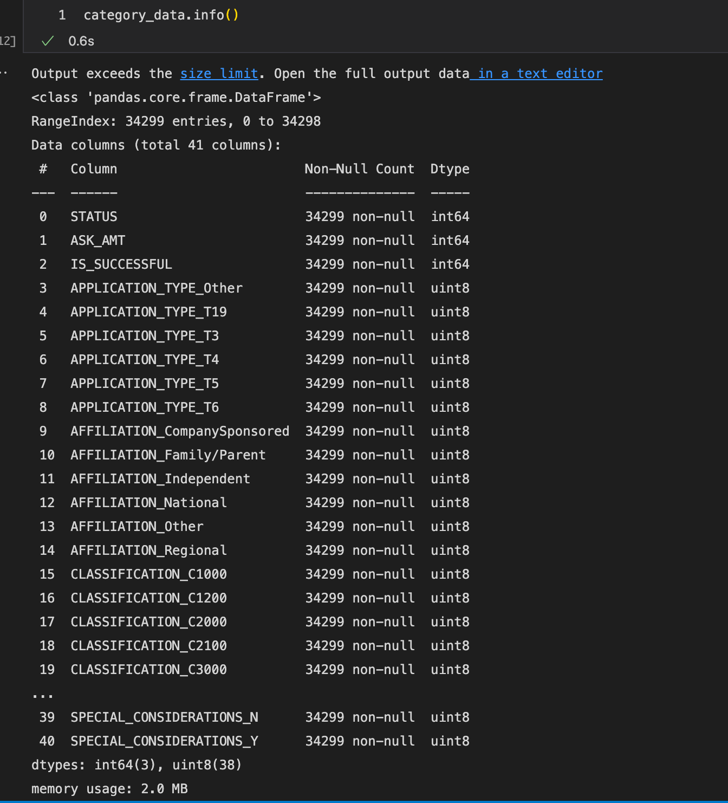

# 16__MachineLearning__deeplearning-challenge
16__MachineLearning__deeplearning-challenge

# Overview of the analysis:

The purpose of this analysis was to train a machine learning model and neural network to predict whether future funding opportunities would be successful or not based on the data of past applicants funded by Alphabet Soup.

# Results:

## 01 Data Preprocessing

### What variable(s) are considered the target(s) for your model?

    The variable considered the target was whether the applicant would be successful or not.  In the data that would be the IS_SUCCESSFUL classificer.

### What variable(s) are considered to be the features for your model?

    The variables that are considered to be features for this model were the remaining categories in the dataset.  I did reduce the number of application types several types through different optimization attempts.  Application types were reduce from 17 types down to 6 in one attempt.  The amount of classifications were also reduce in order to optimize the performance of the model.  Classifications were reduce from 71 types down to 6.

    
### What variable(s) are neither targets nor features, and should be removed from the input data?

    I combined down from the application types that had less than a 800 counts of the application types.  For the classification, we reduced everything that had less than 1000 counts among the various classification types.  In my 3rd and 4th attempt at optimizing, I dropped the organization category as to me, organization would not be necessary as a feature for the input data.

## 02 Compiling, Training, and Evaluating the Model

### How many neurons, layers, and activation functions did you select for your neural network model, and why?

    Through all of my attempts I had 2-3 hidden layers and neurons that ranged from 10-100 and mainly stuck with relu and sigmoid for my activation functions.  The best attempt at approaching 75% accuracy was in my first attempt at optimization.  I reached a 72.9% with 2 hidden layers, using relu and sigmoid activation functions, and 80 and 40 neurons for 1st and 2nd hidden layers, respectively.

### Were you able to achieve the target model performance?

    I wasn't able to reach 75% accuracy.

### What steps did you take to try and increase model performance?

    I tried reducing the number of features, dropping the organization category, adjusted the number of hidden layers and neurons along with activation functions.

# Summary:

Overall, I never got pass 73% even with reducing the number of features, dropping the organization category from the list of features, and adjusting the number of hidden layers and neurons along with the activiation functions.  My best attempt was getting to 72.9% accuracy by reducing the number of features down to 40 and with 2 hidden layers, 80 and 40 neurons for each hidden layer, respectively, and relu and sigmoid activation functions.

My suggestion would be to try a Random Forest model.  Random Forest model offers high accuracy and with the amount of raw data that we currently would make better sense.  With deep learning model, it would still require more data to further optimize the neural network.  Both would require computational power but with deep learning, we need more data.